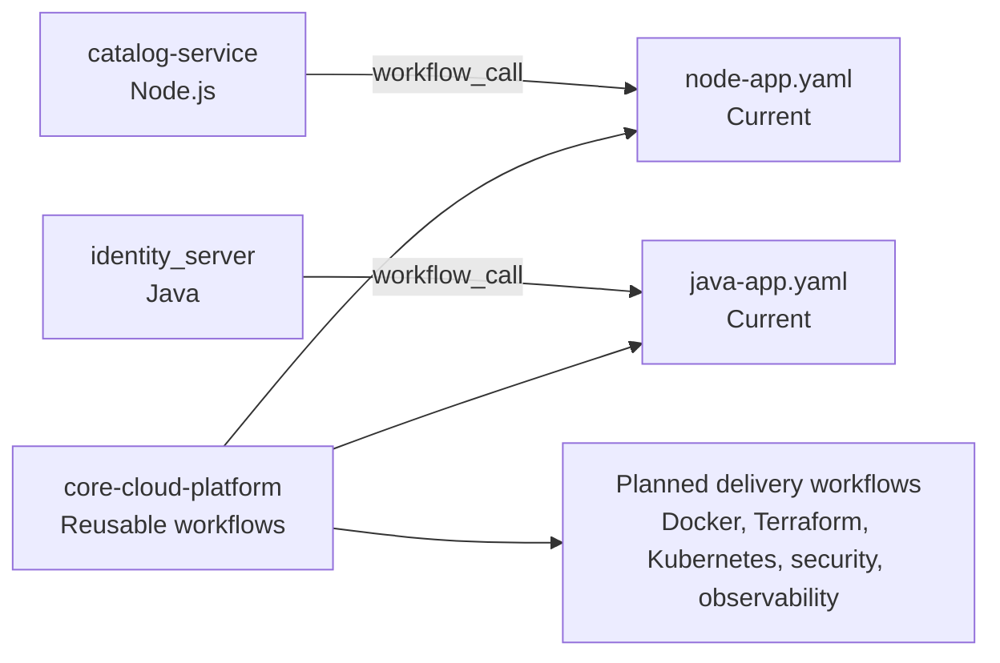
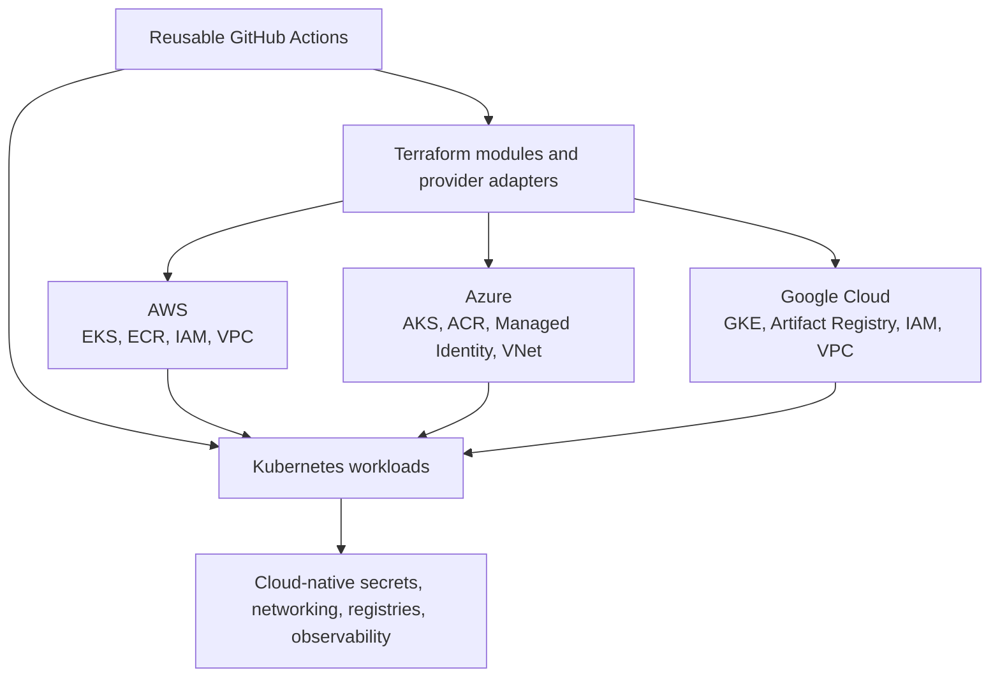

# Core Cloud Platform

Organization repository for reusable GitHub Actions workflows and shared delivery standards.

The complete application architecture, service responsibilities, technology stack, and runtime diagrams are maintained in the [workspace architecture README](../README.md). This document covers the shared workflow platform.

## Platform Model

Application repositories own their source code and service-specific triggers. This repository owns common build, test, packaging, security, infrastructure, deployment, and promotion workflow contracts.



## Current Reusable Workflows

### `node-app.yaml`

Path: `.github/workflows/node-app.yaml`

Current consumers include `catalog-service`.

- Reusable trigger: `workflow_call`
- Configurable `node-version`, default `20`
- Configurable `run-tests`, default `true`
- Ubuntu runner
- Node.js setup with npm caching
- `npm ci`
- Conditional `npm test`
- Optional `npm run build --if-present`

### `java-app.yaml`

Path: `.github/workflows/java-app.yaml`

Current consumers include `identity_server`.

- Reusable trigger: `workflow_call`
- Configurable `java-version`, default `21`
- Configurable `run-tests`, default `true`
- Ubuntu runner with Temurin JDK
- Maven dependency caching
- `mvn clean compile`
- Conditional `mvn test`
- `mvn package -DskipTests`
- JAR artifact upload

### Reuse pattern

Service repositories provide only their event triggers and workflow inputs. For example:

```yaml
jobs:
	build:
		uses: ppmcad16a-cloud-platform/core-cloud-platform/.github/workflows/node-app.yaml@main
		with:
			node-version: "20"
			run-tests: true
```

This keeps service-specific configuration separate from common CI behavior and avoids duplicating build and test steps across repositories.

## Current Versus Planned State

| Capability | Current state | Planned organization workflow |
|---|---|---|
| Node.js build and test | Implemented | Extend with outputs, coverage, and configurable working directories |
| Java compile, test, package | Implemented | Add verification, coverage reporting, and configurable Maven goals |
| Docker image publishing | Placeholder workflow only | `docker-build-publish.yaml` |
| Terraform provisioning | Placeholder workflow only | `terraform-plan-apply.yaml` |
| Kubernetes deployment | Not implemented | `kubernetes-deploy.yaml` |
| Security scanning | Placeholder workflow only | `security-scan.yaml` |
| Observability dashboards | Not implemented | `observability.yaml` |
| Secrets management | Not implemented | `secrets.yaml` and cloud workload identity |
| Production promotion | Not implemented | `promote-production.yaml` |
| AWS, Azure, and Google Cloud | Platform boundaries only | Provider adapters behind common workflow contracts |

The files `.github/workflows/docker-build.yaml`, `.github/workflows/security-scan.yaml`, and `.github/workflows/terraform.yaml` are currently placeholders.

## Planned Reusable Workflow Catalog

All future workflows should use `workflow_call`, explicit inputs and outputs, least-privilege permissions, and GitHub Environments where approvals are required.

| Workflow | Responsibility | Representative inputs | Expected outputs |
|---|---|---|---|
| `node-app.yaml` | Build and test Node services | Node version, working directory, test command | Test result, build output |
| `java-app.yaml` | Compile, test, and package Java services | Java version, Maven goals, test toggle | JAR artifact, test result |
| `docker-build-publish.yaml` | Build and publish immutable container images | Service, Dockerfile, registry, image tag | Image digest, SBOM |
| `terraform-plan-apply.yaml` | Validate, plan, and apply infrastructure | Cloud, environment, module path, backend | Plan artifact, apply status |
| `kubernetes-deploy.yaml` | Deploy and verify workloads | Cluster, namespace, image digest, values | Rollout status, health result |
| `security-scan.yaml` | Scan source, dependencies, secrets, IaC, and images | Scan scope, severity threshold | SARIF/report, gate result |
| `observability.yaml` | Provision dashboards, alerts, metrics, logs, and traces | Cloud, cluster, service labels | Monitoring configuration |
| `secrets.yaml` | Connect jobs and workloads to secret managers | Cloud, environment, secret paths, role | Short-lived secret access |
| `promote-production.yaml` | Promote a verified release | Artifact digest, source, target environment | Promotion record, release status |

## Planned Delivery Flow

```mermaid
flowchart LR
		PR[Pull request] --> CI[Build and test]
		CI --> Scan[Security and quality gates]
		Scan --> Image[Build and publish image]
		Image --> Plan[Terraform plan]
		Plan --> Apply[Approved infrastructure apply]
		Apply --> Deploy[Kubernetes deployment]
		Deploy --> Verify[Smoke tests and health checks]
		Verify --> Promote[Approved production promotion]
		Promote --> Observe[Dashboards, logs, metrics, traces]
```



## Multi-Cloud Target

The future platform is designed for AWS, Microsoft Azure, and Google Cloud. Kubernetes is the common application runtime, while Terraform modules and workflow inputs isolate provider-specific implementation details.



## Workflow Governance

- Pin third-party actions to reviewed versions or commit SHAs.
- Set explicit `permissions` and use least privilege.
- Prefer GitHub OIDC over long-lived cloud access keys.
- Promote immutable image digests, not mutable tags.
- Keep secrets out of source code, images, Terraform variables, and logs.
- Store Terraform state remotely with encryption and locking.
- Require security and health gates before deployment.
- Use GitHub Environments for staging and production approvals.
- Expose useful outputs such as image digests, plan locations, and rollout status.
- Keep callers thin and common delivery logic centralized here.

## Implementation Order

1. Add Dockerfiles and health checks for deployable services.
2. Implement `docker-build-publish.yaml` with registry authentication and image digests.
3. Add Terraform modules, remote state, and AWS/Azure/Google Cloud adapters.
4. Add Kubernetes manifests or Helm charts and `kubernetes-deploy.yaml`.
5. Implement source, dependency, secret, IaC, and image scanning.
6. Integrate cloud secret managers through OIDC/workload identity.
7. Provision dashboards, alerts, logs, metrics, and traces.
8. Add staging and production approvals, smoke tests, rollback, and promotion.

